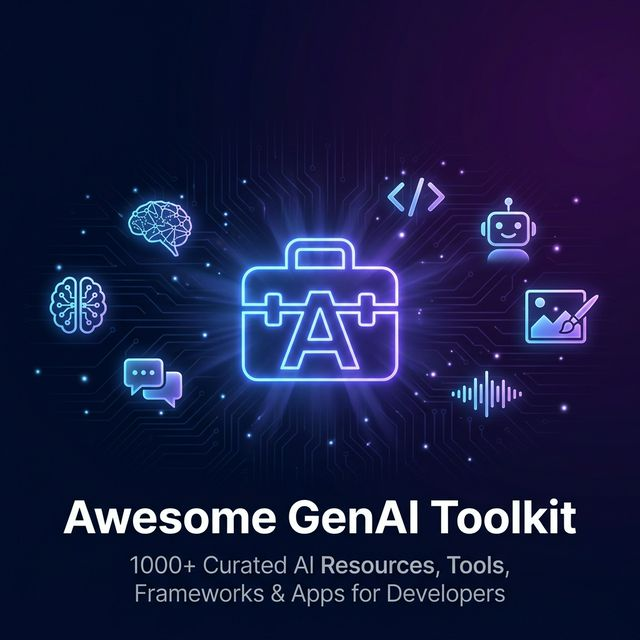

<!-- SEO Meta: Awesome GenAI Toolkit - The most comprehensive open-source collection of 1000+ Generative AI resources, tools, frameworks, apps, and tutorials. Covers LangChain, LlamaIndex, CrewAI, RAG, AI Agents, Voice AI, MCP, Fine-Tuning LLMs, Prompt Engineering, and more. Best generative AI toolkit for developers, researchers, and AI engineers in 2025-2026. -->

# 🚀 Awesome GenAI Toolkit
### The Most Comprehensive Open-Source Collection of Generative AI Resources

**1000+ curated tools, frameworks, apps, and tutorials for building with LLMs, AI Agents, RAG, and more**

**LLM Frameworks** · **AI Agent Frameworks** · **RAG Patterns** · **Fine-Tuning Guides** · **Voice AI** · **MCP Servers** · **Ready-to-Use AI Apps** · **Prompt Optimization**

---

## ❓ Why Star This Repo?

> **If you work with Generative AI in any capacity, this repo will save you hundreds of hours.**

| Benefit | What You Get |
|---------|-------------|
| 🔍 **One Place for Everything** | Stop searching across 50 repos — all the best GenAI tools organized in one toolkit |
| 🧰 **Production-Ready Code** | Clone and deploy real AI apps — not just toy examples |
| 📊 **Side-by-Side Comparisons** | Compare LangChain vs LlamaIndex, CrewAI vs AutoGen, and more with real benchmarks |
| 🎓 **Learning Path** | Beginner → Advanced guides for RAG, Fine-Tuning, Agents, and Prompt Engineering |
| 🔄 **Always Updated** | Community-maintained with the latest tools, models, and frameworks in 2025–2026 |
| 🤝 **Great First Contribution** | Perfect for first-time open-source contributors — no code required for most contributions! |

  <strong>If this repo helps you, please star ⭐ it — it helps others discover it and keeps the project alive.</strong>

---

## 📑 Table of Contents

- [🧠 Open-Source AI Libraries](#-open-source-ai-libraries)
- [💬 AI Apps Collection](#-ai-apps-collection)
- [📊 LLM Benchmarks and Evaluation](#-llm-benchmarks-and-evaluation)
- [🔧 Fine-Tuning LLMs](#-fine-tuning-llms)
- [📚 RAG Techniques and Patterns](#-rag-techniques-and-patterns)
- [🤖 AI Agent Frameworks](#-ai-agent-frameworks)
- [🎙️ Voice AI Agents](#-voice-ai-agents)
- [🔌 MCP AI Agents](#-mcp-ai-agents)
- [⚡ Prompt Optimization](#-prompt-optimization)
- [🤝 How to Contribute](#-how-to-contribute)
- [❓ Frequently Asked Questions (FAQ)](#-frequently-asked-questions-faq)
- [🗺️ Roadmap](#-roadmap)
- [📣 Share This Repo](#-share-this-repo)

---

## 🧠 Open-Source AI Libraries

> **The most popular open-source libraries and frameworks for building generative AI applications in 2025–2026.**

| Category | Top Tools | Combined GitHub Stars |
|----------|-----------|----------------------|
| **LLM Frameworks** | LangChain, LlamaIndex, Haystack | 90K+ |
| **Agent Frameworks** | CrewAI, AutoGen, Agno, LangGraph | 50K+ |
| **Vector Databases** | ChromaDB, Pinecone, Weaviate, Milvus | 40K+ |
| **Inference Engines** | vLLM, Ollama, llama.cpp, TGI | 80K+ |

📖 **Includes:** Comparison tables, setup guides, and recommendations for choosing the right tool for your use case.

**[📂 Browse All Open-Source AI Libraries →](./open-source-libraries/)**

---

## 💬 AI Apps Collection

> **Ready-to-use generative AI applications and starter templates — clone, deploy, and build on top of them.**

| App Type | Description | Tech Stack |
|----------|-------------|------------|
| **Agno Apps** | AI Storyboard Generator & Agentic React Apps | Agno, React, Python |
| **Multimodal RAG** | Enterprise-grade RAG with text, image, and PDF support | Gemini, Streamlit |
| **Chat with Data** | Talk to your PDFs, YouTube videos, GitHub repos, CSVs | Streamlit, FastAPI |
| **Personal Assistant** | Calendar, Email, and Task automation agents | LangChain, Vercel |
| **Vision Apps** | Image analysis, OCR, Object detection pipelines | GPT-4o, Claude 3.5 |

📖 **Includes:** Source code, deployment instructions, and architecture diagrams for each application.

**[📂 Browse AI Apps Collection →](./ai-apps-collection/)**

---

## 📊 LLM Benchmarks and Evaluation

> **How to test, evaluate, and benchmark large language models for accuracy, safety, and performance.**

| Focus Area | Tools & Frameworks | Purpose |
|------------|--------------------|---------| 
| **Performance Testing** | LMSYS Chatbot Arena, HELM | Accuracy & Speed Benchmarking |
| **RAG Evaluation** | Ragas, DeepEval, Arize Phoenix | Retrieval & Generation Quality |
| **Safety & Guardrails** | NeMo Guardrails, Guardrails AI | Content Filtering & Security |

📖 **Includes:** Evaluation frameworks, benchmark datasets, and best practices for LLM quality assurance.

**[📂 Browse LLM Benchmarks →](./llm-benchmarks/)**

---

## 🔧 Fine-Tuning LLMs

> **Step-by-step guides and tools for fine-tuning large language models using LoRA, QLoRA, RLHF, DPO, and more.**

| Technique | Popular Libraries | Use Case |
|-----------|------------------|----------|
| **Parameter-Efficient Fine-Tuning (PEFT)** | PEFT, BitsAndBytes | LoRA, QLoRA on consumer GPUs |
| **Full Fine-Tuning** | Axolotl, Unsloth | Domain-specific model adaptation |
| **Alignment Training** | TRL, Alignment Handbook | SFT, DPO, RLHF for instruction-following |

📖 **Includes:** Training recipes, hyperparameter configs, and cost estimates for fine-tuning popular models.

**[📂 Browse Fine-Tuning Guides →](./fine-tuning-llms/)**

---

## 📚 RAG Techniques and Patterns

> **Learn how to implement Retrieval Augmented Generation (RAG) — from basic pipelines to advanced agentic and multi-hop retrieval systems.**

| Pattern | Description | Complexity |
|---------|-------------|------------|
| **Naive RAG** | Basic retrieve-then-generate pipeline | ⭐ Beginner |
| **Advanced RAG** | Re-ranking, HyDE, Parent Document retrieval | ⭐⭐ Intermediate |
| **Agentic RAG** | Self-correcting retrieval with tool use and multi-hop reasoning | ⭐⭐⭐ Advanced |

📖 **Includes:** Architecture diagrams, code examples, and performance comparisons for each RAG pattern.

**[📂 Browse RAG Techniques →](./rag-techniques/)**

---

## 🤖 AI Agent Frameworks

> **Build autonomous, reliable AI agents using the most popular agent frameworks and orchestration tools.**

| Framework | Best For | Key Feature |
|-----------|----------|-------------|
| **LangGraph** | Stateful agent workflows | Cycles, persistence, and human-in-the-loop |
| **CrewAI** | Multi-agent collaboration | Role-based teams with shared memory |
| **AutoGen** | Task automation | Conversable agents with code execution |
| **Agno** | Lightweight multi-modal agents | Fast, model-agnostic with built-in tools |

📖 **Includes:** Agent architecture patterns, multi-agent system designs, and production deployment tips.

**[📂 Browse AI Agent Frameworks →](./agent-skills/)**

---

## 🎙️ Voice AI Agents

> **Build real-time voice-enabled AI applications with speech-to-text, text-to-speech, and voice pipelines.**

| Component | Top Tools | Capabilities |
|-----------|-----------|--------------| 
| **STT / TTS** | Whisper, ElevenLabs, Deepgram | Transcription & Voice Synthesis |
| **Voice Pipelines** | Vapi, Retell, Livekit | Low-latency conversational AI |
| **Local / Edge Voice** | Piper, Sherpa-ONNX | On-device voice processing |

📖 **Includes:** Integration guides, latency benchmarks, and sample voice agent implementations.

**[📂 Browse Voice AI Agents →](./voice-ai-agents/)**

---

## 🔌 MCP AI Agents

> **Model Context Protocol (MCP) integrations — connect LLMs to databases, APIs, and external tools using the emerging MCP standard.**

| Category | Examples | Purpose |
|----------|----------|---------| 
| **MCP Servers** | SQLite, Postgres, Slack, GitHub | Structured data access for LLMs |
| **Transports** | Stdio, SSE, HTTP Streaming | Communication protocols |
| **MCP Clients** | Claude Desktop, Cursor, Claude Code | User-facing interfaces |

📖 **Includes:** MCP server setup guides, transport configuration, and real-world integration examples.

**[📂 Browse MCP Agents →](./mcp-ai-agents/)**

---

## ⚡ Prompt Optimization

> **Techniques to reduce LLM costs, lower latency, and improve output quality through better prompting strategies.**

| Method | Description | Tooling |
|--------|-------------|---------|
| **Prompt Compression** | Reduce token counts without losing meaning | LLMLingua |
| **Semantic Caching** | Cache and reuse similar query results | GPTCache |
| **Automated Prompt Tuning** | Iteratively optimize prompts with metrics | DSPy |

📖 **Includes:** Cost reduction strategies, caching architectures, and prompt engineering best practices.

**[📂 Browse Prompt Optimization →](./prompt-optimization/)**

---

## 🤝 How to Contribute

> **This is one of the most beginner-friendly open-source projects — no code required for most contributions!**

### ⚡ Quick Ways to Help (Takes < 5 Minutes)

| Action | Impact |
|--------|--------|
| ⭐ **[Star this repo](../../stargazers)** | Helps others discover it on GitHub search |
| 🔱 **[Fork it](../../fork)** | Shows the community is active |
| 🐛 **[Report broken links](../../issues)** | Keeps the toolkit reliable |
| 💡 **[Suggest new categories](../../issues)** | Helps us expand coverage |
| 📢 **[Share on social media](#-share-this-repo)** | Spreads the word to more developers |

### 🛠️ Code & Content Contributions

1. **Fork** the repository
2. **Create** a new branch: `git checkout -b add-resource-name`
3. **Add** your resource to the appropriate category
4. **Submit** a Pull Request with a clear description

📄 See the full [Contributing Guide](CONTRIBUTING.md) for detailed guidelines.

> **🎉 First time contributing to open source?** Look for issues tagged with `good first issue` — they're perfect for getting started!

---

## ❓ Frequently Asked Questions (FAQ)

<strong>What is Generative AI?</strong>

 

Generative AI refers to artificial intelligence systems that can **create new content** — including text, images, code, audio, and video — based on patterns learned from training data. Popular models include **ChatGPT (OpenAI)**, **Claude (Anthropic)**, **Gemini (Google)**, **LLaMA (Meta)**, and **Stable Diffusion**.

<strong>What is RAG (Retrieval Augmented Generation)?</strong>

 

RAG is a technique that enhances LLM responses by **retrieving relevant information from external knowledge bases** before generating an answer. It reduces hallucinations, keeps responses grounded in up-to-date data, and is the most popular pattern for building enterprise AI applications. See our [RAG Techniques section](#-rag-techniques-and-patterns).

<strong>What is MCP (Model Context Protocol)?</strong>

 

MCP is an **open standard** (created by Anthropic) that allows large language models to securely connect to external tools, databases, and APIs. Think of it as "USB for AI" — a universal way for LLMs to access real-time data and perform actions. See our [MCP section](#-mcp-ai-agents).

<strong>What is the best framework for building AI agents?</strong>

 

It depends on your use case:
- **LangGraph** → Complex stateful workflows with cycles and human-in-the-loop
- **CrewAI** → Multi-agent collaboration with role-based teams
- **AutoGen** → Automated task execution with code generation
- **Agno** → Lightweight, model-agnostic agents with built-in tools

See our [AI Agent Frameworks section](#-ai-agent-frameworks) for detailed comparisons.

<strong>How do I fine-tune an LLM on my own data?</strong>

 

Start with **parameter-efficient methods** like LoRA or QLoRA using libraries like **PEFT**, **Unsloth**, and **Axolotl** — they work on consumer GPUs (even a single RTX 3090). See our [Fine-Tuning Guides](#-fine-tuning-llms) for step-by-step instructions.

<strong>Is this repo actively maintained?</strong>

 

Yes! We **regularly add new tools**, update existing resources, and accept community contributions. Check our badges at the top for the last commit date and contributor count. We aim to stay current with the fast-moving GenAI ecosystem.

<strong>How can I contribute if I'm new to open source?</strong>

 

This is a perfect repo for first-time contributors! Most contributions don't require any code — you can:
- Add a link to a useful tool or resource
- Fix a typo or broken link
- Write a short description for a new category

See our [Contributing Guide](CONTRIBUTING.md) and look for `good first issue` labels.

---

## 🗺️ Roadmap

- [x] 🚀 Launch initial 9 categories with curated resources
- [x] 📱 Add real deployable AI apps (Agno, RAG, Multimodal)
- [ ] 📓 Add runnable Google Colab notebooks for each category
- [ ] 🗳️ Community voting on best tools per category
- [ ] 📰 Monthly "What's New in GenAI" digest newsletter
- [ ] 🌍 Multilingual docs (Hindi, Mandarin, Spanish, Japanese)
- [ ] 🌐 Interactive web version with search and filtering
- [ ] 🏆 "Hall of Fame" for top contributors

---

## 📈 Star History

---

## 📣 Share This Repo

> **Help us reach more developers! Pick your platform and share with one click:**

---

### 🌟 Built by the GenAI Community, for the GenAI Community 🌟

 

Every ⭐ star, 🔱 fork, and 🤝 contribution makes this toolkit better for everyone.

 

 
 

**Made with ❤️ by [Shubh Vedi](https://github.com/shubh-vedi) and [Contributors](https://github.com/shubh-vedi/awesome-genai-toolkit/graphs/contributors)**

 

📌 <strong>Keywords:</strong> awesome list, generative AI, GenAI tools, LLM frameworks, LangChain, LlamaIndex, CrewAI, AutoGen, RAG tutorial, retrieval augmented generation, AI agents, voice AI, MCP, model context protocol, fine-tune LLM, LoRA, QLoRA, prompt engineering, open source AI, best AI tools 2025, best AI tools 2026, artificial intelligence resources, machine learning tools, ChatGPT alternatives, Claude AI, Gemini AI, LLaMA, vector database, ChromaDB, AI developer toolkit

